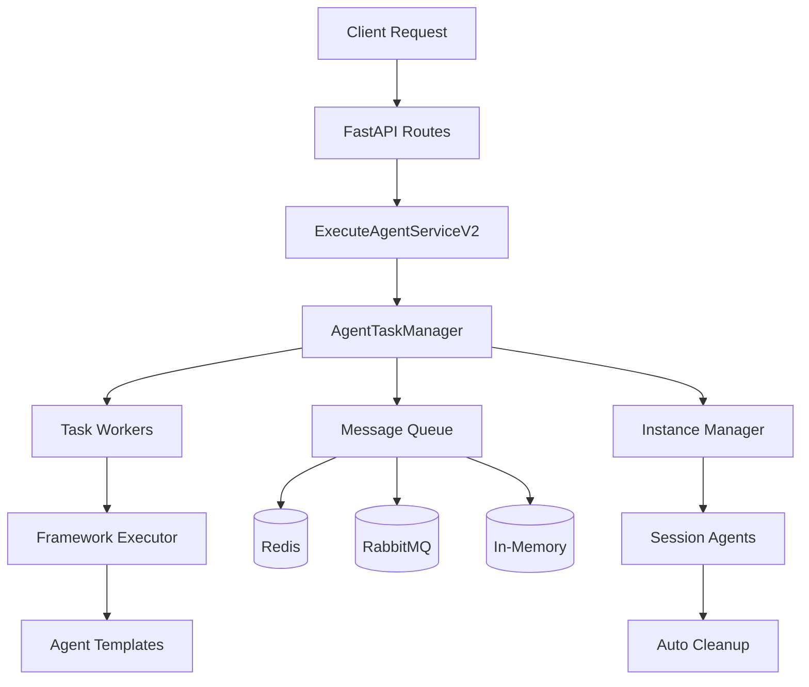

# Async Task Management Architecture

## 🏗️ **Architectural Evolution**

The agent runtime has been completely refactored from instance-based execution to **async task management with message queue orchestration**. This addresses your identified issues while providing a scalable, maintainable foundation.

## ❌ **Previous Issues Resolved**

### Before: Instance Management in Framework
- ❌ **Performance Overhead**: Creating agent instances on every execution
- ❌ **Lost Context**: No conversation memory between executions  
- ❌ **Resource Waste**: `active_agents` being flushed instead of reused
- ❌ **Tight Coupling**: Framework handled both execution AND instance management
- ❌ **Poor Scalability**: Single-threaded, synchronous execution

### After: Async Task Management System
- ✅ **Performance Optimized**: Reuse session-based agent instances
- ✅ **Context Preserved**: Conversation continuity across messages
- ✅ **Resource Efficient**: Automatic cleanup with configurable timeouts
- ✅ **Clean Separation**: Framework = pure executor, Application = instance manager
- ✅ **Horizontally Scalable**: Async workers with message queue distribution

## 🎯 **New Architecture Overview**



## 🔧 **Core Components**

### 1. **Message Queue Interface**
```python
# Extensible message queue with multiple implementations
MessageQueueInterface:
  - InMemoryMessageQueue (development/testing)
  - RedisMessageQueue (production, horizontal scaling)
  - RabbitMQMessageQueue (enterprise, advanced routing)
```

**Key Features:**
- Priority-based message ordering
- Retry logic with exponential backoff
- Dead letter queue handling
- Message acknowledgment patterns
- Queue statistics and monitoring

### 2. **Agent Task Manager**
```python
AgentTaskManager:
  - Agent instance management (session-based)
  - Async task execution with workers
  - Automatic cleanup of inactive sessions
  - Message queue orchestration
  - Health monitoring and metrics
```

**Capabilities:**
- **Session-Based Instances**: One agent per `(agent_id, session_id)` 
- **Async Workers**: Configurable worker pool for parallel execution
- **Instance Lifecycle**: Create → Use → Timeout → Cleanup
- **Resource Management**: Memory-efficient with automatic cleanup

### 3. **Pure Framework Executor**
```python
FrameworkExecutor:
  - Stateless agent execution only
  - No instance management responsibilities
  - Template validation and metadata
  - LLM and toolset service integration
```

**Design Principles:**
- **Single Responsibility**: Only executes agents, no state management
- **Stateless Operations**: All context passed via parameters
- **Template Focus**: Framework knows templates, not instances
- **Resource Cleanup**: No persistent resources to manage

### 4. **Execution Context Management**
```python
ExecutionContext:
  - Conversation history tracking
  - Session metadata management
  - Automatic history trimming
  - Serializable state for persistence
```

## 📋 **Message Flow Architecture**

### Execution Flow
```
1. Client Request → ExecuteAgentServiceV2
2. Service → AgentTaskRequest → TaskManager
3. TaskManager → QueueMessage → MessageQueue
4. TaskWorker → QueueMessage → Framework Executor
5. Framework → Agent Template → LLM Response
6. Response → QueueMessage → ResultQueue
7. Service → AgentTaskResult → Client
```

### Streaming Flow
```
1. Client Request (stream=true) → ExecuteAgentServiceV2
2. Service → StreamingTaskRequest → TaskManager
3. TaskManager → Creates StreamQueue
4. TaskWorker → Framework.stream_execute()
5. Framework → Yields chunks → StreamQueue
6. Service → Streams chunks → Client
7. Cleanup → Delete StreamQueue
```

## 🔄 **Session Management**

### Session-Agent Mapping
```python
# Unique session keys
session_key = f"{agent_id}#{session_id}"
# Examples:
# "customer-bot-123#session-abc-def"
# "task-agent-456#session-xyz-789"
```

### Lifecycle Management
```python
# Automatic cleanup based on inactivity
instance_timeout = 2 hours (configurable)
cleanup_interval = 1 hour (configurable)

# Manual cleanup
task_manager.destroy_session_agent(agent_id, session_id)
```

## 🚀 **Scalability Features**

### Horizontal Scaling
- **Multiple Workers**: Configurable worker pool per instance
- **Message Queue Distribution**: Redis/RabbitMQ for multi-instance deployment
- **Session Affinity**: Sessions can span multiple runtime instances
- **Load Balancing**: Workers automatically balance task distribution

### Performance Optimizations
- **Instance Reuse**: No creation overhead after first execution
- **Async Execution**: Non-blocking task submission and processing
- **Priority Queues**: High-priority streaming, normal execution
- **Resource Pooling**: Framework resources shared across workers

### Resource Management
- **Memory Efficiency**: Automatic cleanup prevents memory leaks
- **Connection Pooling**: Database and framework connections reused
- **Graceful Degradation**: System continues if individual workers fail
- **Health Monitoring**: Built-in metrics and status reporting

## 🛠️ **Configuration Options**

### Task Manager Settings
```env
TASK_MANAGER_ENABLED=true
TASK_MANAGER_WORKERS=10
TASK_CLEANUP_INTERVAL=3600  # 1 hour
INSTANCE_TIMEOUT=7200       # 2 hours
```

### Message Queue Settings
```env
MESSAGE_QUEUE_TYPE=memory   # memory, redis, rabbitmq
REDIS_URL=redis://localhost:6379
RABBITMQ_URL=amqp://localhost:5672
MAX_QUEUE_SIZE=10000
MESSAGE_RETENTION_HOURS=24
```

### Framework Settings
```env
DEFAULT_FRAMEWORK=langgraph
ENABLED_FRAMEWORKS=langgraph
MAX_CONCURRENT_AGENTS=100
AGENT_EXECUTION_TIMEOUT=300
```

## 📊 **Monitoring & Observability**

### Task Manager Metrics
```python
{
    "task_manager_running": true,
    "worker_count": 10,
    "active_instances": 25,
    "running_tasks": 5,
    "message_queue_type": "InMemoryMessageQueue",
    "cleanup_last_run": "2024-03-20T10:00:00Z",
    "instances_cleaned": 3
}
```

### Message Queue Stats
```python
{
    "queue_name": "agent.tasks",
    "pending_messages": 12,
    "processing_messages": 3,
    "completed_messages": 145,
    "failed_messages": 2,
    "average_processing_time": 1.2
}
```

### Framework Health
```python
{
    "framework": "langgraph",
    "version": "0.2.16",
    "templates_loaded": 5,
    "executor_initialized": true,
    "capabilities": ["streaming", "tools", "memory"]
}
```

## 🔄 **Migration Path**

### Backward Compatibility
- **ExecuteAgentServiceAdapter**: Maintains old API interface
- **AgentExecutionResult**: Adapter for old result format
- **Gradual Migration**: Can run both systems side-by-side

### Breaking Changes
- Framework interface changed from `FrameworkIntegration` to `FrameworkExecutor`
- Agent instances no longer managed by framework factories
- Async initialization required for task manager

## 🎯 **Usage Examples**

### Basic Execution
```python
# New service
service = ExecuteAgentServiceV2(task_manager)
result = await service.execute(command)

# Backward compatible
service = ExecuteAgentServiceAdapter(task_manager)
result = await service.execute(command)  # Returns old format
```

### Streaming Execution
```python
async for chunk in service.execute_streaming(command):
    # OpenAI-compatible streaming chunks
    print(chunk['choices'][0]['delta']['content'])
```

### Instance Management
```python
# List active instances
instances = await service.get_agent_instances()

# Cleanup specific session
await service.destroy_session_agent(agent_id, session_id)

# Automatic cleanup runs in background
```

## 🚀 **Future Enhancements**

### Database Persistence
```python
# Session state persistence across restarts
class DatabaseSessionStore:
    async def save_session(context: ExecutionContext)
    async def restore_session(agent_id, session_id) -> ExecutionContext
```

### Distributed Sessions
```python
# Multi-instance session management
class DistributedSessionManager:
    async def get_session_instance(session_id) -> str  # instance_id
    async def migrate_session(session_id, to_instance: str)
```

### Advanced Routing
```python
# Message routing based on agent type/load
class SmartMessageRouter:
    async def route_task(task: AgentTaskRequest) -> str  # queue_name
    async def balance_load() -> Dict[str, int]  # instance_load
```

## ✅ **Benefits Summary**

### Performance
- ✅ **No Instance Creation Overhead**: Reuse existing session agents
- ✅ **Async Task Processing**: Non-blocking, parallel execution
- ✅ **Resource Efficiency**: Automatic cleanup prevents memory leaks
- ✅ **Horizontal Scaling**: Multiple workers, distributed message queues

### Architecture
- ✅ **Clean Separation of Concerns**: Framework = executor, Application = manager
- ✅ **Testability**: Each component independently testable
- ✅ **Extensibility**: Easy to add new queue types or frameworks
- ✅ **Maintainability**: Clear interfaces and responsibility boundaries

### Operations  
- ✅ **Observability**: Built-in metrics and health monitoring
- ✅ **Reliability**: Retry logic, error handling, graceful degradation
- ✅ **Scalability**: Configurable workers, queue distribution
- ✅ **Flexibility**: Multiple deployment options (single instance, distributed)

This architecture transformation addresses all your original concerns while providing a robust foundation for future scaling and feature development! 🎉