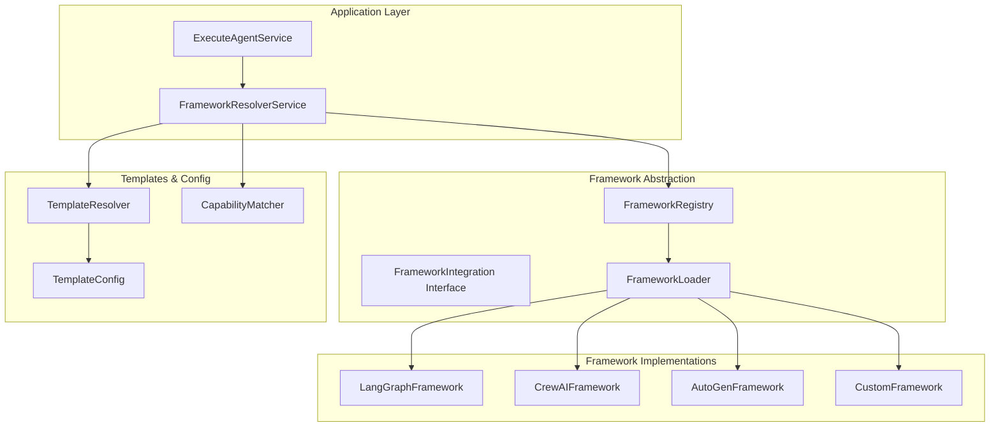

# Dynamic Framework Loading Architecture

## Overview

The Agent Runtime implements a **pluggable framework architecture** that allows dynamic loading and execution of different AI framework implementations (LangGraph, CrewAI, AutoGen, etc.) based on agent templates and configurations.

## Architecture Principles

### 1. **Framework Abstraction Layer**
- All frameworks implement the same `FrameworkIntegration` interface
- Frameworks are loaded dynamically at runtime
- Each framework is self-contained with its own dependencies
- Framework selection is transparent to the application layer

### 2. **Plugin-Based Design**
- Frameworks are discovered automatically via registry pattern
- Support for hot-swapping frameworks without runtime restart
- Isolated execution environments prevent framework conflicts
- Extensible design allows adding new frameworks easily

### 3. **Template-Driven Resolution**
- Agent templates specify preferred framework(s)
- Fallback mechanisms for unsupported templates
- Framework capability matching (streaming, tools, etc.)
- Version compatibility checking

## Component Architecture



## Implementation Details

### 1. Framework Interface

```python
class FrameworkIntegration(ABC):
    """Base interface all frameworks must implement."""
    
    @abstractmethod
    async def execute_agent(self, request: AgentExecutionRequest) -> AgentExecutionResult:
        """Execute an agent with the given request."""
        pass
    
    @abstractmethod
    async def execute_agent_streaming(self, request: AgentExecutionRequest) -> AsyncGenerator[StreamChunk, None]:
        """Execute an agent with streaming response."""
        pass
    
    @abstractmethod
    def get_supported_templates(self) -> List[str]:
        """Get list of supported template IDs."""
        pass
    
    @abstractmethod
    def get_capabilities(self) -> Set[str]:
        """Get framework capabilities (streaming, tools, memory, etc.)."""
        pass
    
    @abstractmethod
    async def validate_configuration(self, agent: Agent) -> ValidationResult:
        """Validate agent configuration for this framework."""
        pass
```

### 2. Framework Registry

```python
class FrameworkRegistry:
    """Dynamic framework discovery and registration."""
    
    def __init__(self):
        self._frameworks: Dict[str, FrameworkIntegration] = {}
        self._template_mappings: Dict[str, List[str]] = {}
        self._capability_index: Dict[str, Set[str]] = {}
    
    async def discover_frameworks(self) -> None:
        """Auto-discover available frameworks."""
        # Scan for framework modules
        # Load and register each framework
        # Build capability and template indexes
        pass
    
    def register_framework(self, framework: FrameworkIntegration) -> None:
        """Register a framework implementation."""
        name = framework.name
        self._frameworks[name] = framework
        
        # Index templates
        for template_id in framework.get_supported_templates():
            if template_id not in self._template_mappings:
                self._template_mappings[template_id] = []
            self._template_mappings[template_id].append(name)
        
        # Index capabilities
        self._capability_index[name] = framework.get_capabilities()
    
    def get_frameworks_for_template(self, template_id: str) -> List[str]:
        """Get frameworks that support a template."""
        return self._template_mappings.get(template_id, [])
    
    def get_frameworks_with_capability(self, capability: str) -> List[str]:
        """Get frameworks that support a capability."""
        return [
            name for name, caps in self._capability_index.items()
            if capability in caps
        ]
```

### 3. Framework Resolver Service

```python
class FrameworkResolverService:
    """Resolves the best framework for an agent execution."""
    
    def __init__(self, registry: FrameworkRegistry):
        self.registry = registry
    
    async def resolve_framework(
        self, 
        agent: Agent, 
        requirements: ExecutionRequirements
    ) -> FrameworkIntegration:
        """Resolve the best framework for an agent execution."""
        
        # 1. Get candidate frameworks based on template
        candidates = self.registry.get_frameworks_for_template(agent.template_id)
        
        if not candidates:
            # Fallback to frameworks supporting the agent type
            agent_type = self._extract_agent_type(agent.template_id)
            candidates = self.registry.get_frameworks_for_template(f"generic-{agent_type}")
        
        if not candidates:
            # Final fallback to default framework
            candidates = ["langgraph"]
        
        # 2. Filter by required capabilities
        if requirements.streaming:
            candidates = [
                name for name in candidates
                if "streaming" in self.registry.get_framework(name).get_capabilities()
            ]
        
        if requirements.tools:
            candidates = [
                name for name in candidates
                if "tools" in self.registry.get_framework(name).get_capabilities()
            ]
        
        # 3. Score and rank candidates
        best_framework = await self._score_frameworks(candidates, agent, requirements)
        
        # 4. Load and return the framework
        framework = self.registry.get_framework(best_framework)
        await framework.initialize()
        return framework
    
    async def _score_frameworks(
        self, 
        candidates: List[str], 
        agent: Agent, 
        requirements: ExecutionRequirements
    ) -> str:
        """Score frameworks based on compatibility and performance."""
        scores = {}
        
        for framework_name in candidates:
            framework = self.registry.get_framework(framework_name)
            score = 0
            
            # Configuration compatibility
            validation = await framework.validate_configuration(agent)
            if validation.is_valid:
                score += 100
            else:
                score -= len(validation.errors) * 10
            
            # Capability match score
            required_caps = requirements.get_required_capabilities()
            framework_caps = framework.get_capabilities()
            matching_caps = len(required_caps & framework_caps)
            score += matching_caps * 20
            
            # Performance preference (configurable)
            performance_weights = {
                "langgraph": 10,  # Fast, reliable
                "crewai": 8,      # Good for multi-agent
                "autogen": 6,     # Good for conversation
            }
            score += performance_weights.get(framework_name, 5)
            
            scores[framework_name] = score
        
        # Return highest scoring framework
        return max(scores.items(), key=lambda x: x[1])[0]
```

### 4. Framework Discovery

```python
class FrameworkLoader:
    """Dynamically loads framework implementations."""
    
    def __init__(self):
        self.loaded_frameworks: Dict[str, FrameworkIntegration] = {}
    
    async def discover_and_load_frameworks(self) -> List[FrameworkIntegration]:
        """Discover and load all available framework implementations."""
        frameworks = []
        
        # 1. Scan framework directories
        framework_dirs = self._scan_framework_directories()
        
        # 2. Load each framework module
        for framework_dir in framework_dirs:
            try:
                framework = await self._load_framework_from_directory(framework_dir)
                if framework:
                    frameworks.append(framework)
                    self.loaded_frameworks[framework.name] = framework
            except Exception as e:
                logger.warning(f"Failed to load framework from {framework_dir}: {e}")
        
        # 3. Load frameworks from configuration
        config_frameworks = await self._load_frameworks_from_config()
        frameworks.extend(config_frameworks)
        
        return frameworks
    
    def _scan_framework_directories(self) -> List[Path]:
        """Scan for framework implementation directories."""
        framework_base_dir = Path(__file__).parent / "frameworks"
        framework_dirs = []
        
        for item in framework_base_dir.iterdir():
            if item.is_dir() and not item.name.startswith("_"):
                # Check if it has a framework.py file
                if (item / "framework.py").exists():
                    framework_dirs.append(item)
        
        return framework_dirs
    
    async def _load_framework_from_directory(self, framework_dir: Path) -> Optional[FrameworkIntegration]:
        """Load a framework from a directory."""
        try:
            # Import the framework module
            module_name = f"runtime.infrastructure.frameworks.{framework_dir.name}.framework"
            framework_module = importlib.import_module(module_name)
            
            # Find the framework class (should end with "Framework")
            framework_class = None
            for attr_name in dir(framework_module):
                attr = getattr(framework_module, attr_name)
                if (
                    isinstance(attr, type) 
                    and issubclass(attr, FrameworkIntegration) 
                    and attr != FrameworkIntegration
                ):
                    framework_class = attr
                    break
            
            if framework_class:
                # Instantiate and validate the framework
                framework = framework_class()
                await framework.initialize()
                return framework
                
        except Exception as e:
            logger.error(f"Failed to load framework from {framework_dir}: {e}")
            return None
    
    async def _load_frameworks_from_config(self) -> List[FrameworkIntegration]:
        """Load frameworks specified in configuration."""
        # Load from environment variables or config files
        # This allows deployers to specify additional frameworks
        configured_frameworks = settings.additional_frameworks or []
        frameworks = []
        
        for framework_config in configured_frameworks:
            try:
                framework = await self._load_framework_from_config(framework_config)
                if framework:
                    frameworks.append(framework)
            except Exception as e:
                logger.warning(f"Failed to load configured framework {framework_config}: {e}")
        
        return frameworks
```

### 5. Template Configuration

```python
class TemplateFrameworkMapping:
    """Maps agent templates to preferred frameworks."""
    
    def __init__(self):
        self.mappings = self._load_template_mappings()
    
    def _load_template_mappings(self) -> Dict[str, Dict[str, Any]]:
        """Load template-to-framework mappings from configuration."""
        return {
            # Conversation agents
            "customer-service-bot": {
                "preferred_frameworks": ["langgraph", "crewai"],
                "required_capabilities": ["streaming", "memory"],
                "fallback_type": "conversation"
            },
            "chat-assistant": {
                "preferred_frameworks": ["langgraph", "autogen"],
                "required_capabilities": ["streaming", "tools"],
                "fallback_type": "conversation"
            },
            
            # Task agents
            "task-execution-bot": {
                "preferred_frameworks": ["crewai", "langgraph"],
                "required_capabilities": ["tools", "planning"],
                "fallback_type": "task"
            },
            "workflow-agent": {
                "preferred_frameworks": ["crewai"],
                "required_capabilities": ["multi_agent", "planning"],
                "fallback_type": "task"
            },
            
            # Custom agents
            "custom-code-agent": {
                "preferred_frameworks": ["langgraph"],
                "required_capabilities": ["code_execution"],
                "fallback_type": "custom"
            },
            
            # Generic fallbacks
            "generic-conversation": {
                "preferred_frameworks": ["langgraph"],
                "required_capabilities": ["streaming"],
                "fallback_type": None
            },
            "generic-task": {
                "preferred_frameworks": ["langgraph"],
                "required_capabilities": ["tools"],
                "fallback_type": None
            }
        }
    
    def get_mapping(self, template_id: str) -> Dict[str, Any]:
        """Get framework mapping for a template."""
        return self.mappings.get(template_id, self.mappings["generic-conversation"])
```

## Usage Example

### Updated ExecuteAgentService

```python
class ExecuteAgentService:
    """Enhanced service with dynamic framework resolution."""
    
    def __init__(self, uow: UnitOfWorkInterface, framework_resolver: FrameworkResolverService):
        self.uow = uow
        self.framework_resolver = framework_resolver
    
    async def execute(self, command: ExecuteAgentCommand) -> AgentExecutionResult:
        """Execute an agent using dynamically resolved framework."""
        
        # 1. Load the agent
        agent = await self._load_agent(command.agent_id)
        
        # 2. Determine execution requirements
        requirements = ExecutionRequirements(
            streaming=command.stream,
            tools=self._requires_tools(agent),
            memory=self._requires_memory(agent),
            capabilities=self._extract_required_capabilities(agent)
        )
        
        # 3. Resolve the best framework
        framework = await self.framework_resolver.resolve_framework(agent, requirements)
        
        # 4. Transform request to framework format
        framework_request = await self._transform_to_framework_request(command, agent)
        
        # 5. Execute using the resolved framework
        if command.stream:
            return framework.execute_agent_streaming(framework_request)
        else:
            result = await framework.execute_agent(framework_request)
            return self._transform_from_framework_result(result, command)
```

## Benefits

### 1. **Flexibility**
- Support multiple AI frameworks simultaneously
- Choose optimal framework per agent type
- Easy addition of new frameworks
- Runtime framework switching

### 2. **Performance**
- Framework specialization for different use cases
- Optimal resource utilization
- Capability-based selection
- Load balancing across frameworks

### 3. **Maintainability**
- Clear separation of concerns
- Framework-agnostic application logic
- Isolated framework dependencies
- Consistent interfaces

### 4. **Extensibility**
- Plugin-based architecture
- Hot-swappable components
- Configuration-driven behavior
- Version management

## Configuration

### Framework Configuration

```yaml
# runtime-config.yaml
frameworks:
  discovery:
    auto_scan: true
    directories:
      - "/app/frameworks"
      - "/opt/custom-frameworks"
  
  default_framework: "langgraph"
  
  template_mappings:
    "customer-service-bot":
      preferred: ["langgraph", "crewai"]
      required_capabilities: ["streaming", "memory"]
    
    "task-execution-bot":
      preferred: ["crewai", "langgraph"]
      required_capabilities: ["tools", "planning"]
  
  framework_specific:
    langgraph:
      max_concurrent_executions: 50
      timeout_seconds: 300
      memory_limit_mb: 1024
    
    crewai:
      max_concurrent_executions: 20
      timeout_seconds: 600
      memory_limit_mb: 2048
```

## Next Steps

1. **Implement Framework Registry** - Start with basic registry and LangGraph framework
2. **Add Framework Loader** - Implement dynamic discovery and loading
3. **Create Resolver Service** - Implement smart framework selection logic
4. **Add More Frameworks** - Implement CrewAI and AutoGen integrations
5. **Performance Optimization** - Add caching, pooling, and load balancing
6. **Monitoring & Metrics** - Track framework performance and usage
7. **Configuration Management** - Implement runtime configuration updates

This architecture provides a solid foundation for a production-ready, scalable agent runtime that can adapt to different use cases and leverage the strengths of various AI frameworks.